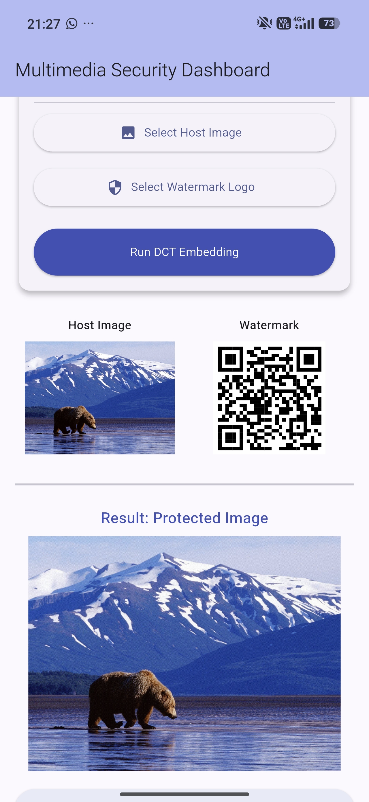
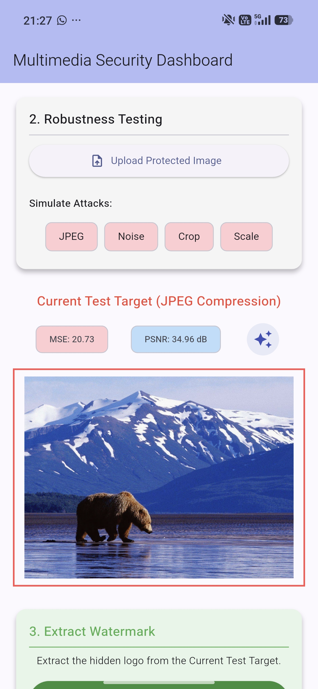
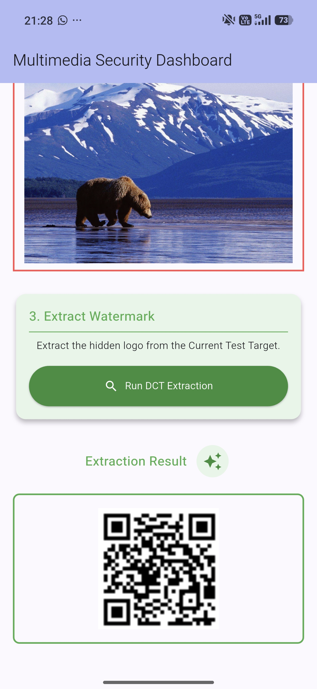
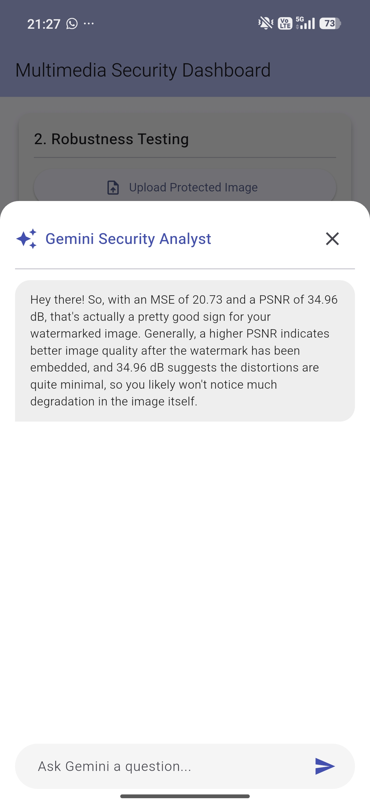

# 🛡️ SecureMark: Robust Multimedia Security Dashboard & Watermarking Engine


SecureMark is an advanced cross-platform application developed to provide robust multimedia copyright protection and security auditing. By bridging the gap between low-level computer vision algorithms and modern web technology, SecureMark offers a secure, resilient, and interactive dashboard tailored specifically for digital creators, researchers, and security analysts.

---

## 📌 Project Overview
**SecureMark** leverages **Discrete Cosine Transform (DCT)** block-based digital watermarking combined with advanced robustness countermeasures (**Redundant Tiling** and a **Majority Voting System**). 

The system provides a sleek desktop dashboard (Flutter) seamlessly connected to a robust **cloud web services** architecture. By offloading heavy computational lifting to a high-performance image processing engine (FastAPI/OpenCV via Render.com), SecureMark allows users to rapidly embed secure identifiers into host media, simulate aggressive geometric and signal attacks, and utilize an integrated **Gemini AI** agent for instant mathematical security analytics.

---

## 🚀 Key Features

* **Advanced DCT Watermarking:** Injects binary watermarks into the mid-frequency coefficients of the luminance channel via 8x8 pixel block partitioning.
* **Redundant Tiling Architecture:** Automatically forces watermarks into fixed 64x64 arrays and tiles them seamlessly across the entire image to defend against structural loss.
* **Majority Voting Extraction System:** Recovers damaged watermarks by checking surviving blocks post-attack and calculating pixel-state probabilities to filter out mathematical noise.
* **Attack Simulator Workstation:** Real-time simulation of industry-standard security threats:
  * **JPEG Compression** (Aggressive high-frequency quantization)
  * **Gaussian Noise Injection** (Signal corruption)
  * **Center Cropping** (Geometric data loss via structural blackouts)
  * **Resolution Scaling** (Downsampling and bilinear upsampling data loss)
* **Real-time Analytical Auditing:** Computes **Mean Squared Error (MSE)** and **Peak Signal-to-Noise Ratio (PSNR)** on-the-fly.

---

## 📱 User Interface Previews

### 1. Embed Watermark (Security Workflow)
*Select a high-resolution host image, choose your core security watermark, and invoke the cloud DCT embedding engine to secretly bind the payload.*
<br>


### 2. Robustness Testing Workstation
*Simulate signal corruption, aggressive JPEG down-quantization, or cropping attacks. Features Gemini AI integration to analyze real-time changes in MSE and PSNR metrics.*
<br>


### 3. Extract Watermark (Payload Recovery)
<br>


### 3. Gemini AI Insights Panel
*Interact with a localized LLM agent to get instantaneous breakdowns of how the Majority Voting algorithm successfully defended the asset against degradation.*
<br>


---

## ☁️ Cloud Web Service Setup (Render.com)

The FastAPI computer vision engine is designed to be hosted via cloud web services to offload heavy processing from the user's local device.

### 1. Prepare the Backend Repository
Ensure your Python backend code contains a `requirements.txt` file listing all dependencies (e.g., `fastapi`, `uvicorn`, `opencv-python-headless`, `numpy`, `python-multipart`).

### 2. Deploy to Render
1. Create a free account on [Render.com](https://render.com).
2. Click **New +** and select **Web Service**.
3. Connect your GitHub account and select your backend repository.
4. Configure the following build settings:
   * **Runtime:** `Python 3`
   * **Build Command:** `pip install -r requirements.txt`
   * **Start Command:** `uvicorn app:app --host 0.0.0.0 --port $PORT`
5. Click **Create Web Service**. Render will automatically provision a cloud server and deploy your OpenCV API.

### 3. Connect the Frontend
Once Render provides your live URL (e.g., `https://dct-watermarking-project.onrender.com`), open your Flutter project's `main.dart` and update the API constant:
```dart
final String apiUrl = "[https://your-render-url-here.onrender.com](https://your-render-url-here.onrender.com)";
